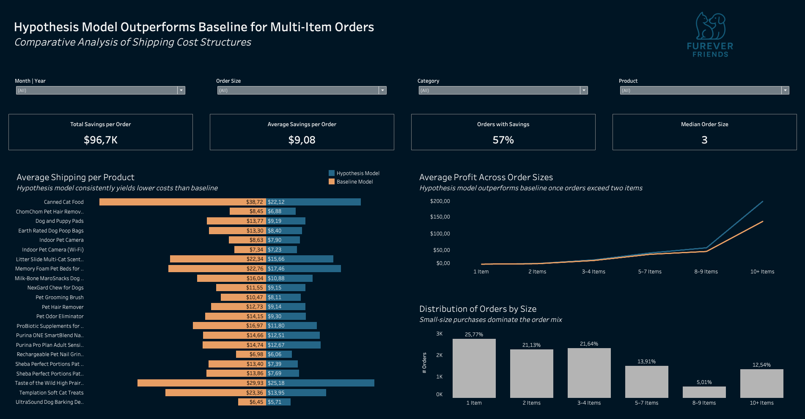
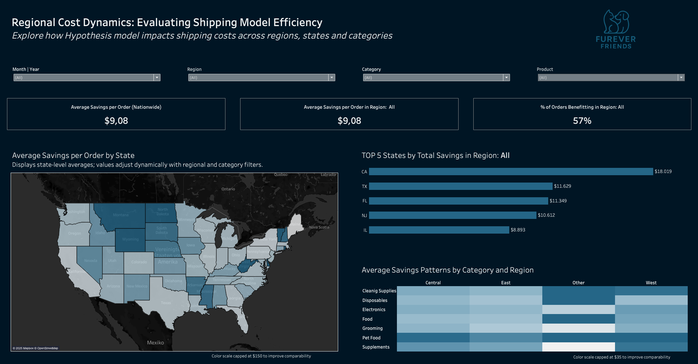

# 📦 Shipping Model Profitability Analysis

## Comparing Baseline vs. Hypothesis Shipping Cost Models to Optimize Profitability and Order Behavior

**Data source:** E-Commerce transactions (Dec 2020 – Dec 2021)  
**Note:** All company names and the logo used in the dashboard are fictional and created for illustrative purposes only.

---

## 🧭 Project Overview

This project analyzes the financial impact of a new shipping cost model (“Hypothesis Model”) compared to the existing Baseline Model.  
The goal was to evaluate how adjusting shipping cost logic for multi-item orders affects total shipping expenses, profitability, and order composition across U.S. regions.

The analysis combines transactional, product, customer, and state mapping data into a unified dataset and visualizes key findings using Tableau Public.

---

## 🗂️ Data Model and Transformation

All data preparation and feature creation were done via `data_preparation_shipping_models.sql`.  
The script performs cleaning, normalization, enrichment, and calculation of both shipping models.

### Data Sources

| Table | Description |
|:------|:-------------|
| `fact_sales` | Contains transaction-level data including product, quantity, sales, and price. |
| `dim_customers` | Includes customer locations (city, postal code, latitude, longitude). |
| `dim_products` | Contains product category, weight, landed cost, and shipping cost. |
| `state_region_mapping` | Maps nonstandard state names and codes to standardized state and region labels. |

### Key Transformations

- **Data Cleaning:** Normalized product descriptions, coerced quantity/sales/unit price consistency.  
- **Feature Engineering:** Created `profit_per_unit`, `baseline_shipping_cost`, and `hypothesis_shipping_cost`.  
- **Model Logic:**
  - Baseline Model: 100% cost for first item, 70% for additional items.  
  - Hypothesis Model: Progressive discount by quantity tiers (0.8 → 0.3 factor).  
- **Profit Calculation:** Computed `profit_after_baseline` and `profit_after_hypothesis`.  
- **Granularity:** Each record represents a single invoice line (`InvoiceLine`).  
  In Tableau, measures were aggregated to invoice-level (`Order`) using LOD expressions for KPIs such as “Orders with Cost Reductions”.

---

## 📊 Analytical Approach

Two interactive dashboards were built in Tableau Public.

### Interactive Dashboard

View on [Tableau Public](https://public.tableau.com/views/ShippingCostAnalysis_17609775769340/Dashboard1_modelcomparison?:language=de-DE&:sid=&:redirect=auth&:display_count=n&:origin=viz_share_link)

---

### Dashboard 1 – Model Comparison Overview



**Objective:** Evaluate average cost and profit differences between the Baseline and Hypothesis models.

#### Key KPIs

- **Total Savings per Order:** Overall shipping cost reduction per invoice under the Hypothesis model.  
- **Average Savings per Order:** Mean savings amount per order compared to the Baseline model.  
- **Orders with Savings:** Share of invoices where the Hypothesis model yields lower costs.  
- **Median Order Size:** Typical number of items per order, highlighting the relationship between order volume and savings potential.

#### Insights

- On average, 57% of all orders show lower shipping costs under the Hypothesis model.  
- Cost reductions are driven primarily by multi-item orders (≥ 2 items).  
- Average savings per order are moderate in single-item orders but grow exponentially with order size.  
- Approximately 43% of orders show no difference, meaning both models yield identical costs.

---

### Dashboard 2 – Regional and Product Breakdown



**Objective:** Assess cost reduction patterns across U.S. states and product categories.

#### Visuals and Metrics

- **Choropleth Map – Average Savings by State:**  
  Shows mean cost savings per order per state.  
  Color scale capped at $150 to prevent distortion from outliers.  

- **Bar Chart – Top 5 States by Total Savings:**  
  Displays top-performing states by total savings.  
  Uses `SUM(total_savings)` per state, dynamically filtered by region.  

- **Heatmap – Average Savings Patterns by Category and Region:**  
  Aggregates average savings across regions and product categories.  
  Color scale capped for readability to manage variability in outliers.

#### Insights

- The **East**, **Central**, and **West** regions contribute the majority of total savings, while the **Other** region trails significantly in cumulative savings volume.  
- However, average savings per order are highest in the **Other** region due to extreme outliers — particularly the **Virgin Islands (VI)**, where average shipping savings exceed \$2,000 per order.  
- After adjusting for this outlier, average savings patterns align more closely with total savings distribution across regions.  
- Overall, the Hypothesis model demonstrates consistent efficiency across major regions, with cost reductions strongest in high-volume areas (East and Central).

---

## 📈 Data Characteristics and Limitations

- **Period:** December 2020 – December 2021  
- **Granularity:** InvoiceLine (later aggregated to Invoice for KPIs)  
- **Outliers:** Some locations (e.g., Virgin Islands) exhibit high average shipping costs; color scales capped for visual clarity.  
- **Neutral Orders:** About 43% of orders yield identical costs under both models.  
- **Geographic Coverage:** U.S. customers only.  

---

## 💡 Recommendations

### 1. Operational
- Adopt the Hypothesis Shipping Model, especially for multi-item orders.  
- Monitor outlier states with high costs.  
- Consider dynamic shipping discounts tied to order weight or category.

### 2. Marketing
- Promote bundled purchases to increase the share of multi-item orders.  
- Implement product recommendation logic such as “Customers who bought X also bought Y.”  
- Use cost-efficient states for regional campaigns promoting “Smart Shipping Savings.”

### 3. Data and Analytics
- Introduce automated outlier detection for states and categories.  
- Integrate real shipping data to calibrate Hypothesis discount tiers.  
- Extend the model with margin sensitivity analysis per region.

---

## Example SQL Excerpt

Below is a shortened snippet from `data_preparation_shipping_models.sql` illustrating the model logic:

```sql
-- Shipping model logic example
CASE
    WHEN quantity = 1 THEN costs
    ELSE costs + (costs * 0.7 * (quantity - 1))
END AS baseline_shipping_cost,

CASE
    WHEN quantity = 1 THEN 1.0
    WHEN quantity = 2 THEN 0.8
    WHEN quantity <= 4 THEN 0.6
    WHEN quantity <= 7 THEN 0.5
    WHEN quantity <= 9 THEN 0.4
    ELSE 0.3
END AS hypothesis_factor
```

Full transformation logic is available in the main SQL file.

---

## Files Included

**Project Structure**
- `shipping-model-analysis/`
  - [`data_preparation_shipping_models.sql`](data_preparation_shipping_models.sql) – SQL script for data cleaning and model logic  
  - [`shipping_cost_analysis_dataset.csv`](shipping_cost_analysis_dataset.csv) – Final analytical dataset  
  - [`shipping_cost_sample.csv`](shipping_cost_sample.csv) – 20 random sample rows  
  - [`README.md`](README.md) – Project documentation
  - [`data_model_overview.md`](data_model_overview.md) – Description of tables
  - [`dashboard_1_overview.png`](dashboard_1_overview.png) – Screenshot: Dashboard 1 - Overview
  - [`dashboard_2_regional.png`](dashboard_2_regional.png) – Screenshot: Dashboard 2 - Regional Analysis

---

## Author and Notes

This project was developed as part of a mock business case analyzing an e-commerce dataset.
The company name and logo are fictional, created solely for visualization purposes.
All data is anonymized and used for educational demonstration.
